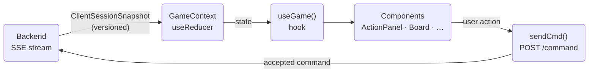
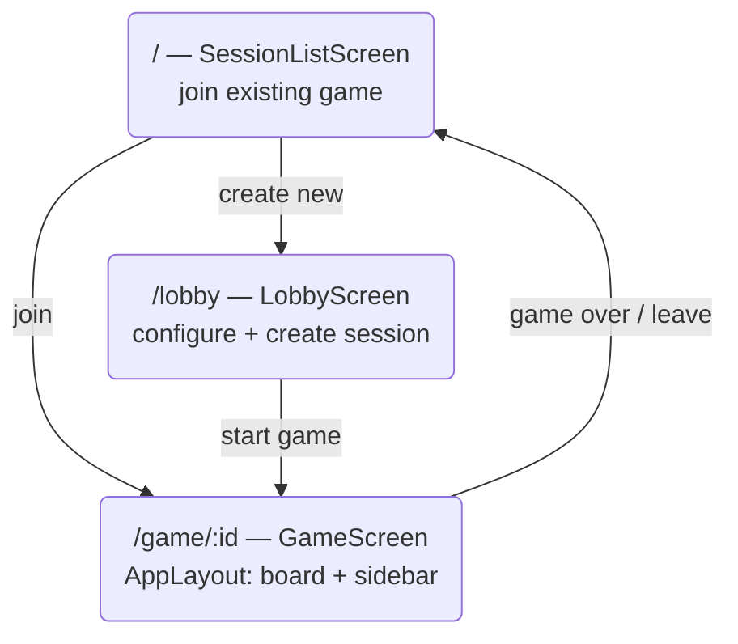
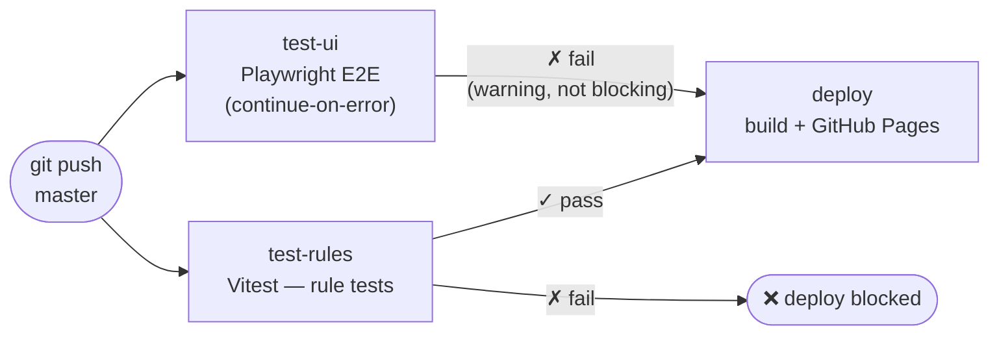

# monopoly-client

Helsinki-themed multiplayer Monopoly — React/TypeScript SPA. All game state comes from the backend; the client is purely reactive.

**Live:** https://jukkakot.github.io/monopoly-client/  
**Backend:** https://monopoly-backend-bv41.onrender.com

---

## Quick start

```bash
# 1. Install dependencies
npm install

# 2. Copy environment variables and set the backend URL
cp .env.example .env.local
# edit VITE_API_BASE if needed

# 3. Start the dev server
npm run dev   # → http://localhost:5173
```

---

## Commands

| Command | Description |
|---|---|
| `npm run dev` | Vite dev server (HMR, localhost:5173) |
| `npm run build` | TypeScript check + production build → `dist/` |
| `npm run lint` | ESLint |
| `npm run deploy` | Build + publish to GitHub Pages |
| `npm run test:rules` | Vitest rule tests (integration against live backend) |
| `npm run test:ui` | Playwright E2E tests |

---

## Environment variables

| Variable | Default | Description |
|---|---|---|
| `VITE_API_BASE` | `http://localhost:8080` | Backend URL |
| `VITE_AXIOM_TOKEN` | — | Axiom logging (optional) |
| `VITE_AXIOM_DATASET` | — | Axiom dataset (optional) |

---

## Architecture

React 19 + TypeScript SPA (Vite, HashRouter).

### Data flow



1. `GameContext` holds all state in a `useReducer`.
2. An `EventSource` connects to `GET /sessions/{id}/events` and receives versioned `ClientSessionSnapshot` events.
3. Reconnection uses exponential backoff with `lastEventId` for resumption.
4. All player actions are `POST /sessions/{id}/command` calls via `sendCmd()`.
5. Components read state through the `useGame()` hook — no local game state anywhere else.

### Screen flow



### Key files

| File | Description |
|---|---|
| `src/store/GameContext.tsx` | All game state, SSE connection, `sendCmd` |
| `src/types/api.ts` | All backend-facing types (40+ interfaces) |
| `src/types/spots.ts` | Static board definition (40 Helsinki spots) |
| `src/components/actions/ActionPanel.tsx` | Phase-driven action panel |

### ActionPanel phases

`ActionPanel` renders different button groups based on `TurnState.phase`:

| Phase | Action |
|---|---|
| `WAITING_FOR_ROLL` | Roll dice / jail escape |
| `WAITING_FOR_DECISION` | Buy or decline property |
| `WAITING_FOR_AUCTION` | Place auction bid or pass |
| `RESOLVING_DEBT` | Pay debt, mortgage, sell buildings, or declare bankruptcy |
| `WAITING_FOR_END_TURN` | Build, mortgage, trade, end turn |

---

## Testing

### Rule tests (Vitest, integration)

```bash
npm run test:rules          # run once
npm run test:rules:watch    # watch mode
npm run test:rules:ui       # Vitest UI
```

Tests live in `e2e/rules/` and run commands against the live backend (or whatever `VITE_API_BASE` points to). Scenarios are in `e2e/scenarios/`.

### UI tests (Playwright, E2E)

```bash
npm run test:ui              # headless
npm run test:ui:headed       # browser visible
npm run test:ui:debug        # Playwright UI
```

Playwright starts the dev server automatically and waits for the backend to be ready (`e2e/globalSetup.ts`).

---

## CI/CD

GitHub Actions (`deploy.yml`) runs on every push to `master`:



---

## Deployment

The app is published to GitHub Pages at `/monopoly-client/` (configured in `vite.config.ts`).

```bash
npm run deploy   # build + gh-pages publish
```
